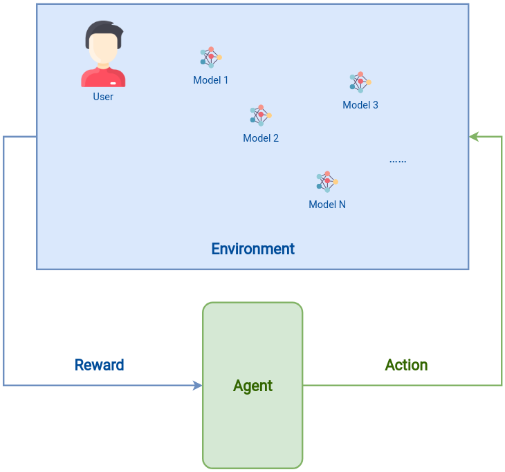
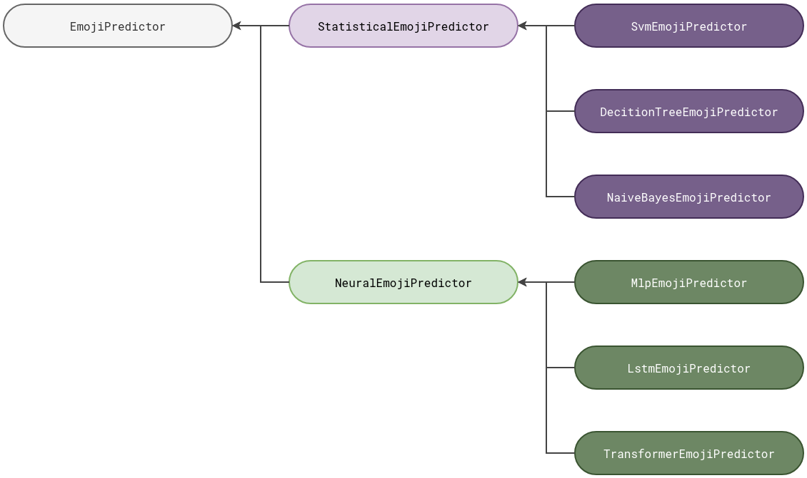

# G-LEAP Experiments



## 1. Datasets and Models

### 1.1 Datasets

[./dataset](./dataset)

### 1.2 Emoji Prediction Models



TODO: Update the table according to the final list

| Model (Arm) Index | Name | (Test) Accuracy | Size | Training Time (total) | Inference Time (per sample) | Notes | Paper | Links |
|---|---|---|---|---|---|---|---|---|
| 0 | SVM |  |  |  |  |  |  |  |
| 1 | RNN |  |  |  |  |  |  |  |
| 2 | Bi-LSTM |  |  |  |  |  |  |  |
| 3 | LSTM |  |  |  |  |  |  |  |
| 4 | BERT | `5286 / 14000 = 37.76%` |  |  |  |  | BERT: Pre-training of Deep Bidirectional Transformers for Language Understanding | [cardiffnlp/bertweet-base-emoji · Hugging Face](https://huggingface.co/cardiffnlp/bertweet-base-emoji) |
| 5 | RoBERTa | `5606 / 14000 = 40.04%` |  |  |  | Twitter-roBERTa-base for Emoji prediction | RoBERTa: A Robustly Optimized BERT Pretraining Approach | [cardiffnlp/twitter-roberta-base-emoji · Hugging Face](https://huggingface.co/cardiffnlp/twitter-roberta-base-emoji) |
| 6 | Decision Tree |  |  |  |  |  |  |  |

## 2. Pipeline

Setup the `conda` environment: [setup.md](setup.md).

```shell
$ conda activate gleap_env
$ bash prepare_statistical.sh
$ python compute_cardiffnlp_models_label_mapping.py
$ bash prepare_neural.sh
$ bash evaluate_models.sh
$ bash generate_history_data.sh
```

## 3. Results

### 3.1 Comparison Simulations

```shell
$ bash run_comparison_simulations.sh
```

### 3.2 V Simulations

```shell
$ bash run_v_simulations.sh
```

### 3.3 B Simulations

G-LEAP under different settings of energy budget.

```shell
$ bash run_b_simulations.sh
```

### 3.4 History Simulations

- `bash ./run_h_simulations.sh`
- `bash ./run_ht_simulations.sh`

### 3.5 Gamma Simulations

`run_gamma_simulations.py`

### 3.6 Latency Variance Simulations

The performance of G-LEAP under different end-to-end latency variances.

`bash run_lv_simulations.sh`

## 4. Source Code Structure

- `./dataset`: The emoji prediction dataset.
- `./transformer_models`: The pretrained transformer-based models saved from the Python `transformers` library.
- `gleap_env.yml`: The environment file for the `conda` environment used for all the experiments (exported using the command `conda env export --name gleap_env | grep -v "^prefix: " > gleap_env.yml`).
- `prepare_datasets.py`: Prepare the train dataset and the test dataset for our experiments.
- `prepare_statistical.py`: Prepare the statistical models by training models from scratch and persist them.
- `prepare_neural.py`: Prepare the neural emoji prediction models by downloading the pretrained models and persist them.
- `evaluate_models.py`: Evaluate the emoji prediction models by testing them on the dataset.
- `setup.md`: The instructions for creating the `conda` environment.
