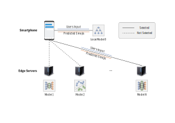
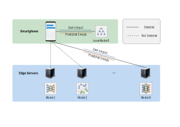
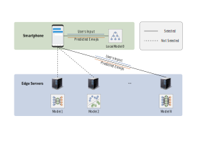
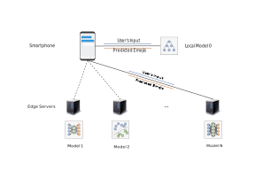
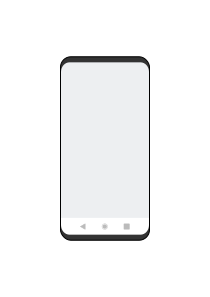
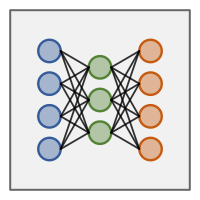
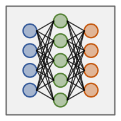
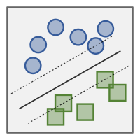
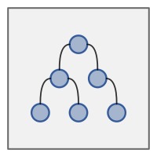

# Diagram for the G-LEAP Scheme

## The Whole Diagram

| Version | Preview |
|---|---|
| 2021.9.1 |  |
| 2021.8.31 |  |
| 2021.8.29 |  |
| 2021.8.28 |  |

## Palette

| Color | Hex |
|---|---|
| Orange | `#c55a11` |
| Blue | `#365b9a` |
| Green | `#548235` |

## Smartphone

## Emoji Prediction Models

- Neural Network Small

  

- Neural Network Large

  

- SVM

  

- Decision Tree

  

## References

- [Edge server icon](https://iconarchive.com/show/vista-hardware-devices-icons-by-icons-land/Home-Server-icon.html)
- [Smartphone](https://www.123rf.com/photo_96875912_stock-vector-modern-smartphone-with-blank-chat-interface-layered-and-detailed-mockup-vector-illustration-.html)
